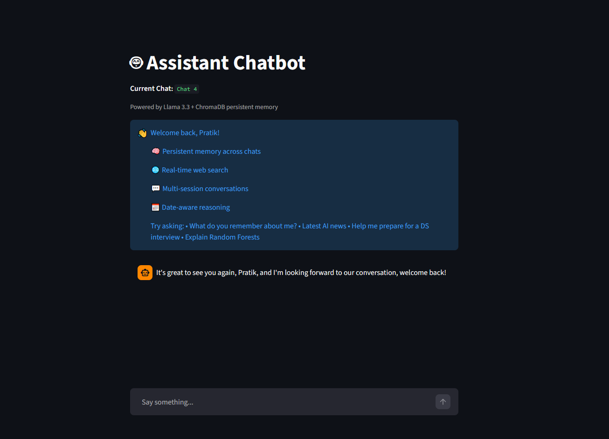
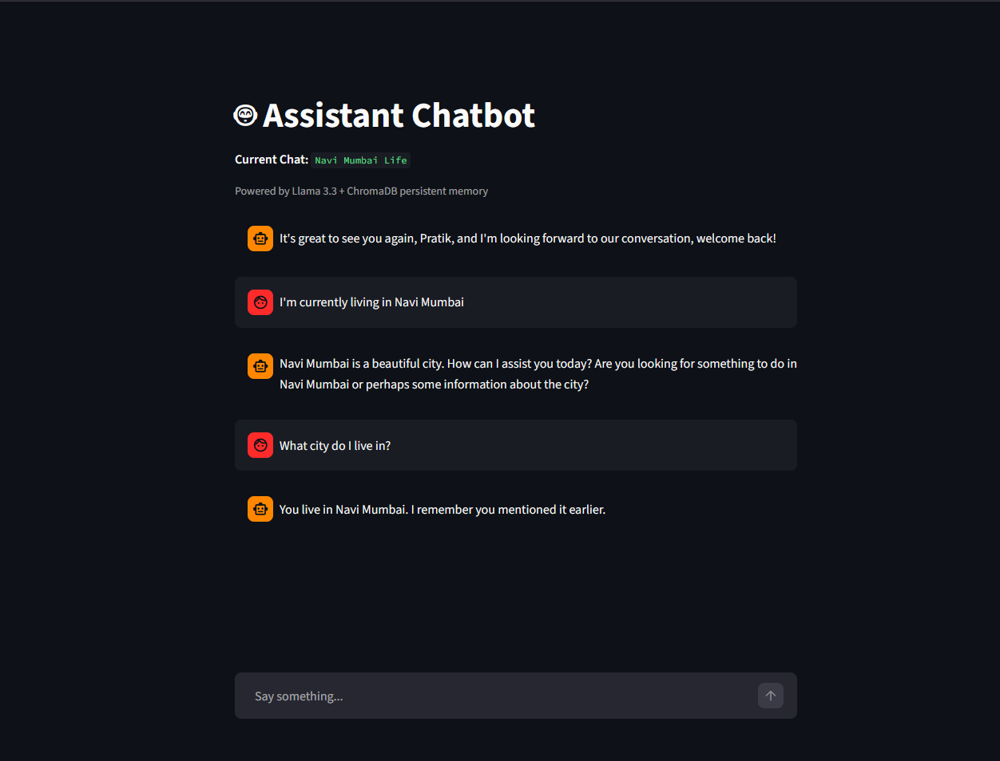
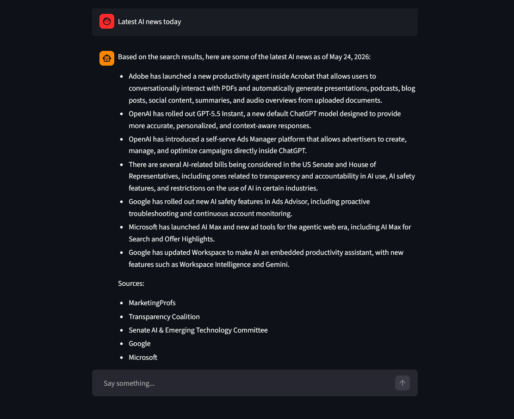
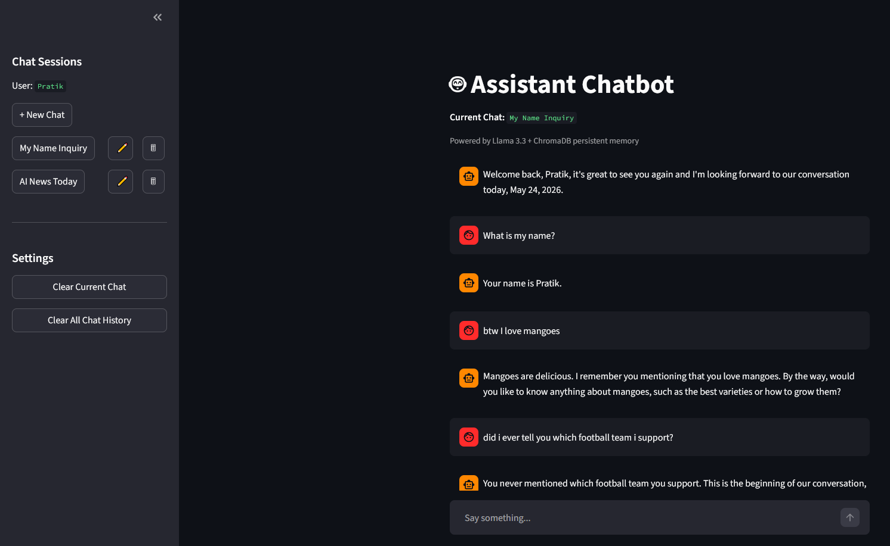

# 🧠 Context-Aware AI Assistant

Built as an AI engineering portfolio project exploring retrieval-augmented generation (RAG), semantic memory systems, and conversational agent design.

An AI-powered conversational assistant with persistent vector memory, multi-session chat management, and real-time web retrieval.

Built using Llama 3.3, LangChain, ChromaDB, Tavily Search, and Streamlit.

---

## 🚀 Live Demo

👉 **Try the app:** https://memory-chatbot-ai.streamlit.app/

---

## 📸 Screenshots

### Main Interface



### Persistent Memory Demo



### Web Search Demo



### Multi-Session Chat Management



---

# Project Overview
This project demonstrates building a context-aware AI assistant capable of:
- remembering relevant information across conversations,
- retrieving real-time web information,
- managing multiple chat sessions,
- maintaining conversational continuity using semantic memory retrieval.

The assistant combines:
- short-term conversational memory through session history,
- long-term semantic memory through vector embeddings,
- dynamic web retrieval for up-to-date information.

The project focuses heavily on:
- retrieval quality,
- memory architecture,
- prompt engineering,
- conversational UX,
- semantic search systems.

---

# ✨ Features

## 🧠 Persistent Semantic Memory
- Long-term memory powered by ChromaDB vector storage
- Retrieves semantically relevant past conversations
- Memory persists across separate chat sessions
- Sentence-level memory chunking for improved retrieval precision
- Similarity-threshold filtering reduces irrelevant memory retrieval

---

## 🌐 Real-Time Web Search
- Tavily Search integration for current information retrieval
- Handles:
  - news
  - weather
  - sports results
  - recent events
  - current information after the model cutoff
- Source-aware responses with clean citation formatting

---

## 💬 Multi-Session Chat Management
- Create multiple chat sessions
- Rename and delete conversations
- Automatic chat title generation based on first user query
- Persistent chat history using SQLite

---

## 🔍 Retrieval-Augmented Context Injection
- Retrieves relevant memories using semantic similarity search
- Injects retrieved context into prompts dynamically
- Prevents irrelevant memory pollution using retrieval filtering


---

## 🎨 Improved Conversational UX
- Clean Streamlit chat interface
- Current active chat indicator
- Welcome onboarding screen
- Typing / thinking indicators
- Cleaner source formatting
- Persistent personalized greetings

---

# Project Structure

```
context-aware-ai-assistant/
│
├── screenshots/
│   ├── main-ui.png
│   ├── memory-demo.png
│   ├── web-search-demo.png
│   └── chat-management.png
│
├── app.py
├── llm.py
├── memory.py
├── storage.py
├── requirements.txt
├── runtime.txt
├── README.md
└── .gitignore

```

---

# 🏗️ Architecture

## Memory System

The assistant uses two memory layers:

### 1. Short-Term Conversational Memory
Maintained through chat session history.

Used for:
- conversational continuity,
- remembering recent exchanges,
- maintaining context inside a session.

---

### 2. Long-Term Semantic Memory
Powered by ChromaDB vector embeddings.

Workflow:
1. User messages are converted into vector embeddings
2. Embeddings are stored in ChromaDB
3. Relevant memories are retrieved using semantic similarity
4. Retrieved context is injected into prompts dynamically

---

## Retrieval Flow

```text
User Input
    ↓
Chat History Retrieval
    ↓
Memory Search (ChromaDB)
    ↓
Relevant Context Injection
    ↓
(Optional) Web Search
    ↓
Llama 3.3 Response Generation
    ↓
Store Conversation in Memory
```

---

# Usage

## Start a New Chat
- Open the streamlit app
- Enter your name or userid name
- Create a new chat session
- Begin interacting with the assistant.

---

# Tech Stack

| Component              | Technology                          |
| ---------------------- | ----------------------------------- |
| LLM                    | Llama 3.3 (llama-3.3-70b-versatile) |
| Inference API          | Groq API                            |
| Framework              | LangChain                           |
| Vector Database        | ChromaDB                            |
| Chat Storage           | SQLite                              |
| Web Search             | Tavily Search                       |
| Frontend               | Streamlit                           |
| Embeddings             | sentence-transformers               |
| Environment Management | python-dotenv                       |

---

# Installation
1. Clone the repo
2. Create a virtual environment
3. `pip install -r requirements.txt`
4. Add your `GROQ_API_KEY` & `TAVILY_API_KEY` to `.env`
5. `streamlit run app.py`

---

# 📈 Key Engineering Concepts Explored
- Retrieval-Augmented Generation (RAG)
- Semantic similarity search
- Vector memory systems
- Prompt orchestration
- Context injection
- Multi-session conversational architecture
- Temporal query normalization
- Persistent conversational memory
- Tool-augmented LLM agents
- Conversational UX design

---

# Engineering Challenges

- Designing a memory system that balances retrieval quality and noise reduction
- Preventing duplicate memory storage across sessions
- Managing persistent chat history alongside vector memory
- Handling relative date normalization for temporal queries
- Optimizing Streamlit performance using resource caching

---

# 🚧 Future Improvements

- Support for file uploads and document Q&A
- User authentication for multi-user support
- LangGraph integration for more complex agentic workflows
- Voice input support
- Mobile-responsive UI
- Docker deployment
- External database persistence (PostgreSQL / pgvector)
- Memory summarization layer
- Debug / observability sidebar
- Streaming responses

---

# 📌 Notes

- Local ChromaDB and SQLite persistence may reset on Streamlit Cloud deployments
- Designed primarily as an AI engineering / retrieval systems portfolio project
- Focused on retrieval quality, memory systems, and conversational architecture rather than only chatbot UI

---
